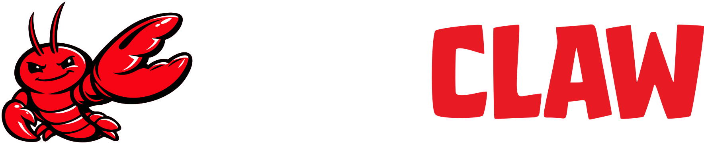
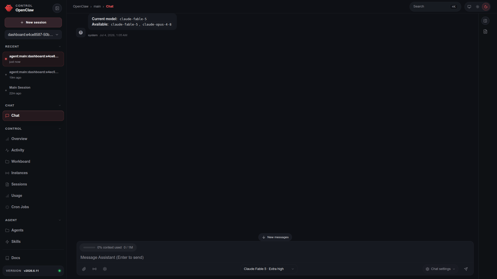
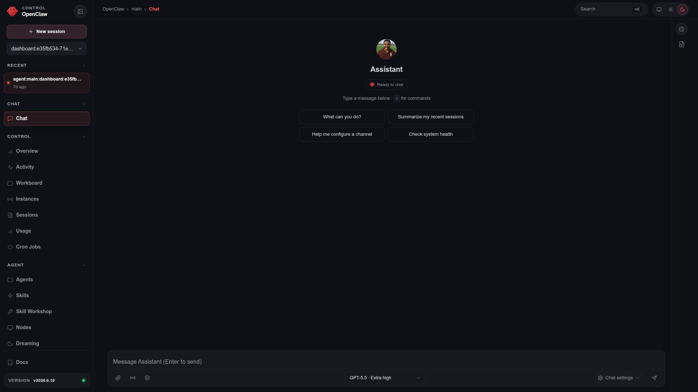

# 🦞 OpenClaw — Personal AI Assistant Training

<p align="center">
  
</p>

<p align="center">
  <a href="https://github.com/SchoolOfFreelancing/Hermes-Agent-Training.git/">OpenClaw Training</a> | <a href="https://github.com/SchoolOfFreelancing/Hermes-Agent-Support.git/">OpenClaw Support</a>
</p>

<p align="center">
  <a href="https://t.me/SchoolOfFreelancingTraining">
    
  </a>

  <a href="https://wa.me/8801748973769">
    
  </a>

   <a href="LICENSE">
   
   </a>
   
</p>

A hands-on Training covering OpenClaw fundamentals, production deployment, and building a profitable service around it.

OpenClaw is a personal AI assistant you run on your own devices. It answers you on the channels you already use. It can speak and listen on macOS/iOS/Android, and can render a live Canvas you control. The Gateway is just the control plane — the product is the assistant.

If you want a personal, single-user assistant that feels local, fast, and always-on, this is it.

Supported channels include: WhatsApp, Telegram, Slack, Discord, Google Chat, Signal, iMessage, IRC, Microsoft Teams, Matrix, Feishu, LINE, Mattermost, Nextcloud Talk, Nostr, Synology Chat, Tlon, Twitch, Zalo, Zalo Personal, WeChat, QQ, WebChat.

<p align="center">
  
| | |
|---|---|
| **Training Duration** | 20 Hours Total • 5 Working Days |
| **Schedule** | 5 Sessions • 4 Hours per Session |
| **Training Format** | Hands-On Instructor-Led Training Online |
| **Skill Level** | Beginner to Job-Ready |
| **Freelance Platform** | Upwork Freelance Marketplace |

</p>

## Prerequisite Training Requirements
- Linux Knowledge (CLI, SSH, package management)
- Node.js Knowledge
- An API key from a model provider (Anthropic, OpenAI, Google, etc.)
- A VPS or cloud account (DigitalOcean/AWS/Linode)
- Cloud Networking Knowledge (DNS, ports, firewalls)
- Upwork Verified Account (For Day 5)

## Training Schedule

### Day 1 — OpenClaw Fundamentals
- What is OpenClaw, architecture overview, core components
- Installation on Linux (dependencies, package manager setup)
- Configuration files and directory structure
- Basic CLI usage and first run
- **Lab:** Install and run OpenClaw locally

### Day 2 — Domain & Networking Setup
- Buying/configuring a domain (registrar, DNS records)
- Pointing A/CNAME records to your server
- Setting up subdomains for OpenClaw services
- Reverse proxy basics (Nginx/Caddy)
- **Lab:** Map a custom domain to your OpenClaw instance

### Day 3 — Production Deployment
- Hardening the VPS (firewall, SSH keys, fail2ban)
- SSL/TLS via Let's Encrypt/Certbot
- Process management (systemd/PM2/Docker)
- Logging, monitoring, and backups
- **Lab:** Deploy OpenClaw to production with HTTPS

### Day 4 — Scaling & Troubleshooting
- Performance tuning and resource limits
- Common errors and debugging workflow
- Update/rollback strategy
- Security best practices (rate limiting, auth)
- **Lab:** Simulate and resolve 3 common production issues

### Day 5 — Upwork Marketplace Service Development
- Identifying OpenClaw service niches (setup, migration, support)
- Writing a compelling Upwork gig title & description
- Pricing models (fixed-price vs hourly, packages)
- Portfolio/proof-of-work prep using Day 1–4 labs
- Client communication and proposal templates
- **Lab:** Publish a live Upwork gig for OpenClaw services

## Outcomes
By the end of this Training, participants will:
- Deploy OpenClaw to a production server with a custom domain and SSL
- Troubleshoot and maintain a live OpenClaw instance
- Have a published, client-ready Upwork service listing

## Resources
- `/configs` — sample config files used in labs
- `/scripts` — setup and deployment scripts
- `/templates` — Upwork gig and proposal templates

- Students who complete this training will get Credential Verification Support from School Of Freelancing.

  ---

## Get Expert Training
Contact us on [WhatsApp](https://wa.me/8801748973769) or [Telegram](https://t.me/SchoolOfFreelancingTraining) to start OpenClaw Hands-on Training.

---

# FAQs

<details>
<summary><b>What is OpenClaw?</b></summary>
OpenClaw is a viral open-source AI assistant that empowers AI models to work as your proactive personal agent. Connect your local files, WhatsApp, Discord, and other applications to automate workflows, streamline productivity, and let AI work for you 24 hours a day, 7 days a week.
</details>

<details>
<summary><b>Do I need coding experience to learn OpenClaw?</b></summary>

No. Coding skills are not required. A basic understanding of Linux, the command line, Node.js, VPS hosting, and cloud networking is all you need to successfully learn and deploy OpenClaw.
</details>

<details>
<summary><b>How long is the OpenClaw training?</b></summary>

The training includes 20 hours of instructor-led learning delivered over 5 working days. You'll attend 5 sessions, with 4 hours of training per session, combining expert instruction with practical, hands-on exercises.
</details>

<details>
<summary><b>What will I be able to do after completing OpenClaw training?</b></summary>

After completing the OpenClaw training, you'll be able to confidently install, configure, secure, and manage OpenClaw on Linux VPS servers. You'll learn how to deploy OpenClaw with Docker, NGINX, SSL, Tailscale, custom domains, and AI model integrations, troubleshoot common issues, and deliver professional OpenClaw setup and support services to clients on freelance platforms.</details>

<details>
<summary><b>What is Client Acquisition & OpenClaw Service Development?</b></summary>

Client Acquisition & OpenClaw Service Development teaches you how to turn your OpenClaw skills into a freelance business. You'll learn how to identify client needs, create high-value OpenClaw service packages, write winning project proposals, communicate professionally with clients, price your services, and deliver production-ready OpenClaw installation, configuration, troubleshooting, and support services on freelance platforms such as Upwork.
</details>

<details>
<summary><b>What is Credential Verification Support?</b></summary>

Credential Verification Support is the service through which School of Freelancing confirms directly to a requesting organization that a named student has successfully completed any of our training and possesses the necessary skills to work with that organization using a specific skill set. This may also include a formal recommendation from School of Freelancing.
</details>

<details>
<summary><b>Can I pay in installments to join the OpenClaw training?</b></summary>

No. We do not offer installment payment options. The full training fee must be paid before the training begins.
</details>

```
───────────────────────────────────────────────
✧(｡•̀ᴗ-)✧ Hands-On Training with the Latest Stable OpenClaw Release
───────────────────────────────────────────────

```



## Disclaimer
This repository is intended to provide guidance, documentation, and support resources related to OpenClaw installation. Product names, trademarks, and service names belong to their respective owners.

⭐ If this repository helps you, please consider starring it and sharing it with others.

<div align="center">

[](https://twitter.com/AnythingLinux)

</div>

<div align="center"> Made with ❤️ in Bangladesh </div>
